<!-- Header -->

  

<!-- Badges y Redes Sociales -->

  
  

## 📜 Sobre mí

📚 Técnico Superior en Desarrollo de Aplicaciones Multiplataforma con Especialización en Big Data e Inteligencia Artificial 
🖥 Ingeniero de datos | Desarrollador Backend | Desarrollador Cloud 
📍 Valladolid / Madrid / Asturias / Remoto desde España

## 🛠️ Stack Tecnológico

### Lenguajes de Programación

<table>
  <tr>
    <td align="center" width="100">
      
       
      <b>Python</b>
    </td>
    <td align="center" width="100">
      
       
      <b>Java</b>
    </td>
    <td align="center" width="100">
      
       
      <b>Kotlin</b>
    </td>
    <td align="center" width="100">
      
       
      <b>C#</b>
    </td>
  </tr>
</table>

### Ingeniería de datos

<table>
  <tr>
    <td align="center" width="100">
      
       
      <b>Spark / PySpark</b>
    </td>
    <td align="center" width="100">
      
       
      <b>Databricks</b>
    </td>
    <td align="center" width="100">
      
       
      <b>Apache Hadoop</b>
    </td>
    <td align="center" width="100">
      
       
      <b>Apache Airflow</b>
    </td>
    <td align="center" width="100">
      
       
      <b>Apache Kafka</b>
    </td>
  </tr>
</table>

### Cloud

<table>
  <tr>
    <td align="center" width="100">
      
       
      <b>Amazon Web Service (AWS)</b>
    </td>
     <td align="center" width="100">
      
       
      <b>Microsoft Azure</b>
    </td>
  </tr>
</table>

### Backend

<table>
  <tr>
    <td align="center" width="100">
      
       
      <b>Spring / SpringBoot</b>
    </td>
     <td align="center" width="100">
      
       
      <b>Flask</b>
    </td>
    <td align="center" width="100">
      
       
      <b>FastAPI</b>
    </td>
    <td align="center" width="100">
      
       
      <b>Firebase</b>
    </td>
  </tr>
</table>

### Bases de Datos
<table>
  <tr>
    <td align="center" width="100">
      
       
      <b>MySQL</b>
    </td>
     <td align="center" width="100">
      
       
      <b>MongoDB</b>
    </td>
  </tr>
</table>

### Control de versiones y DevOps
<table>
  <tr>
    <td align="center" width="100">
      
       
      <b>Git</b>
    </td>
     <td align="center" width="100">
      
       
      <b>GitHub</b>
    </td>
    <td align="center" width="100">
      
       
      <b>Docker</b>
    </td>
    <td align="center" width="100">
      
       
      <b>Jenkins</b>
    </td>
  </tr>
</table>

